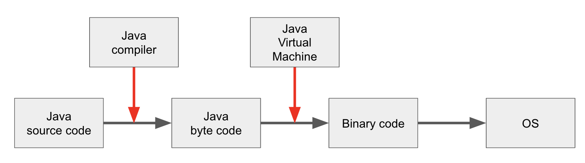

## JVM은 뭘까?

> JVM은 Java Virtual Machine(자바 가상 머신)의 약어로 Java로 개발한 프로그램을 컴파일하여 만들어지는 바이트코드를 실행시키기 위한 가상머신이다.

## JVM의 역할

우리가 작성한 Java 소스코드(.java)는 CPU가 인식하지 못하므로 기계어(Binary Code)로 컴파일을 해줘야한다.
Java 소스코드를 바로 기계어를 변환 시키는 것이 아닌, 우선 컴파일러가 소스코드를 Java 바이트코드(.class)로 변환시킨 다음에 JVM이 Java 바이트코드를 기계어로 변환한다.
따라서 Java 소스파일은 바로 OS 가는 것이 아닌 JVM을 거쳐서 운영체제와 상호작용하기 때문에 운영체제로부터 독립적이라고 할 수 있다.
이를 도식화하면 아래와 같다.

